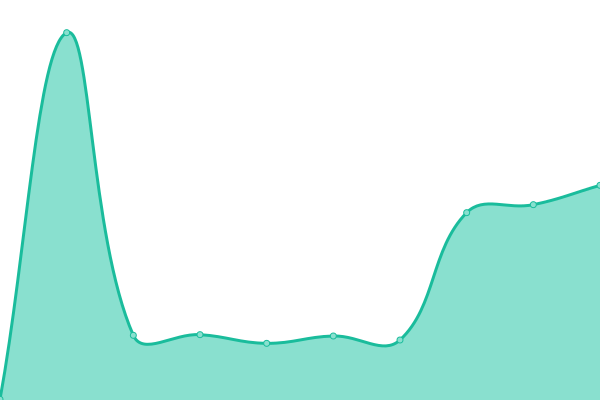

# [📈 Live Status](https://_juunikorn.github.io/status): <!--live status--> **Některé funkce nefunkční**

This repository contains the open-source uptime monitor and status page for [\_juunikorn](https://_juunikorn.github.io/status), powered by [Upptime](https://github.com/upptime/upptime).

With [Upptime](https://upptime.js.org), you can get your own unlimited and free uptime monitor and status page, powered entirely by a GitHub repository. We use [Issues](https://github.com/_juunikorn/status/issues) as incident reports, [Actions](https://github.com/_juunikorn/status/actions) as uptime monitors, and [Pages](https://_juunikorn.github.io/status) for the status page.

<!--start: status pages-->
<!-- This summary is generated by Upptime (https://github.com/upptime/upptime) -->
<!-- Do not edit this manually, your changes will be overwritten -->
<!-- prettier-ignore -->
| URL | Status | History | Response Time | Uptime |
| --- | ------ | ------- | ------------- | ------ |
|  [Google (Reference)](https://www.google.com) | 🟩 Funkční | [google-reference.yml](https://github.com/oskarbukovsky/status/commits/HEAD/history/google-reference.yml) | 

 93ms
     
 | 

<a href="https://oskarbukovsky.github.io/status/history/google-reference">100.00%</a>
    

|  [Minecraft Server](doranda.vagonbrei.eu) | 🟥 Nedostupné | [minecraft-server.yml](https://github.com/oskarbukovsky/status/commits/HEAD/history/minecraft-server.yml) | 

 0ms
     
 | 

<a href="https://oskarbukovsky.github.io/status/history/minecraft-server">95.18%</a>
    

|  [Dynmap](https://dynmap-tech-craft.666777123.xyz/) | 🟩 Funkční | [dynmap.yml](https://github.com/oskarbukovsky/status/commits/HEAD/history/dynmap.yml) | 

 317ms
     
 | 

<a href="https://oskarbukovsky.github.io/status/history/dynmap">24.33%</a>
    

|  [Wiki](https://wiki.666777123.xyz/) | 🟩 Funkční | [wiki.yml](https://github.com/oskarbukovsky/status/commits/HEAD/history/wiki.yml) | 

 308ms
     
 | 

<a href="https://oskarbukovsky.github.io/status/history/wiki">38.41%</a>
    

|  [Obchod](https://shop.666777123.xyz/) | 🟩 Funkční | [obchod.yml](https://github.com/oskarbukovsky/status/commits/HEAD/history/obchod.yml) | 

 331ms
     
 | 

<a href="https://oskarbukovsky.github.io/status/history/obchod">100.00%</a>
    

|  [Plan](https://plan.666777123.xyz/) | 🟩 Funkční | [plan.yml](https://github.com/oskarbukovsky/status/commits/HEAD/history/plan.yml) | 

 434ms
     
 | 

<a href="https://oskarbukovsky.github.io/status/history/plan">24.40%</a>
    

|  [Hosting Panel](https://panel.vagonbrei.eu/) | 🟩 Funkční | [hosting-panel.yml](https://github.com/oskarbukovsky/status/commits/HEAD/history/hosting-panel.yml) | 

 469ms
     
 | 

<a href="https://oskarbukovsky.github.io/status/history/hosting-panel">100.00%</a>
    

<!--end: status pages-->

[**Visit our status website →**](https://_juunikorn.github.io/status)

## 📄 License

- Powered by: [Upptime](https://github.com/upptime/upptime)
- Code: [MIT](./LICENSE) © [Anand Chowdhary](https://anandchowdhary.com), supported by [Pabio](https://pabio.com)
- Data in the `./history` directory: [Open Database License](https://opendatacommons.org/licenses/odbl/1-0/)
